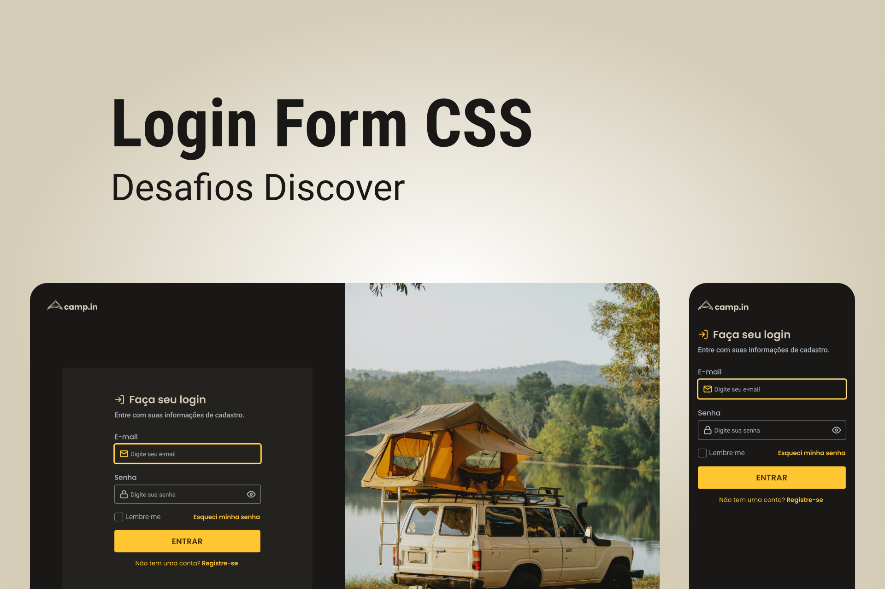

<h1 align="center">
  Login Form
</h1>

  
  
  

<h1 align="center">
  
</h1>

## 💻 Projeto

O projeto de uma página de um formulário de login.

## 🧪 Tecnologias

Esse projeto foi desenvolvido com as seguintes tecnologias

- HTML
- CSS

## 🚀 Como executar

O app estará disponível acessando esse endereço [https://pduartesilva2005.github.io/discover-desafio-login-form/](https://pduartesilva2005.github.io/discover-desafio-login-form/)

---

Feito com 💜 by Pedro Duarte 👋🏻
